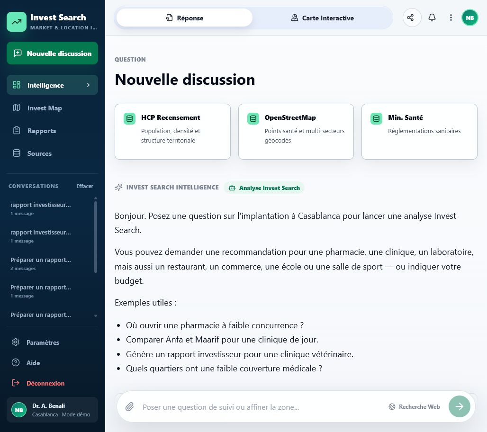
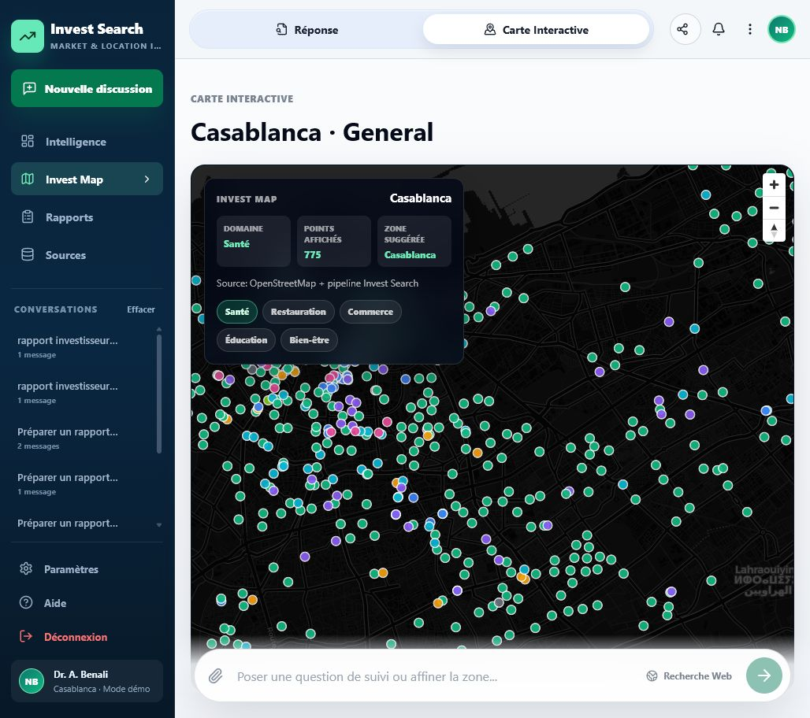

# Invest Search EMines

Invest Search EMines est une plateforme d'aide a la decision pour comparer des zones d'implantation a Casablanca. Elle combine donnees OpenStreetMap, indicateurs territoriaux, scoring d'opportunite, carte interactive et assistant conversationnel RAG.

Le produit couvre d'abord les activites de sante, puis s'etend a plusieurs secteurs locaux: restauration, commerce, education et bien-etre. L'objectif est simple: transformer des donnees publiques dispersees en recommandations lisibles, sourcees et exploitables avant une visite terrain.

## Apercu






## Fonctionnalites

- Question en langage naturel pour pharmacie, clinique, restaurant, ecole, salle de sport ou commerce.
- Recommandation par zone avec score, risque, supply gap, concurrence et sources.
- Carte interactive MapLibre avec filtres multi-secteurs.
- Comparaison de quartiers de Casablanca.
- Rapports investisseur exportables en `.md`, `.html` et `.pdf`.
- RAG local avec citations et garde-fous hors perimetre.
- Outil admin pour collecter, recalculer et reindexer les donnees.

## Stack technique

- Frontend: React, Vite, TypeScript, MapLibre.
- Backend: FastAPI.
- Data: CSV, GeoJSON, Markdown profiles, OpenStreetMap, HCP/MSPS.
- RAG: recherche hybride locale et index documentaire.
- LLM local: Ollama, par exemple `qwen2.5:7b`.
- Deploiement: Vercel pour l'interface, proxy serverless vers FastAPI, backend local ou distant.

## Lancer en local

Installer les dependances Python:

```powershell
python -m venv .venv
.\.venv\Scripts\activate
pip install -r requirements.txt
```

Installer les dependances frontend:

```powershell
cd frontend
npm install
```

Lancer Ollama si le RAG avec LLM local est souhaite:

```powershell
ollama serve
ollama pull qwen2.5:7b
ollama pull nomic-embed-text
```

Lancer l'API:

```powershell
python -m uvicorn server:app --host 0.0.0.0 --port 8000
```

Lancer le frontend:

```powershell
cd frontend
npm run dev
```

Ouvrir:

```text
http://127.0.0.1:5173/app
```

Un script de demarrage rapide est aussi fourni:

```powershell
.\start-demo.ps1
```

## Structure du projet

```text
api/              API FastAPI, chat, marche, admin, RAG
app/              interface Streamlit historique et fonctions analytiques
data/             donnees brutes, traitees, exports GeoJSON et profils de zones
data_sources/     collecte, geocodage, enrichissement, OSM, HCP/MSPS
docs/             methodologie, sources, limites RAG, pitch, audit UI/UX
frontend/         application React/Vite
scripts/          pipelines data et scripts d'evaluation
server.py         point d'entree ASGI
vercel.json       configuration deploiement frontend + proxy API
```

## Verifications utiles

Build frontend:

```powershell
cd frontend
npm run build
```

Compilation Python:

```powershell
python -m compileall api app scripts data_sources
```

Suite de garde-fous conversationnels:

```powershell
python scripts/evaluate_chat_guardrails.py
```

## Notes de validation

Le repo contient les donnees pretraitees necessaires pour lancer une demonstration sans relancer toute la collecte. Les resultats restent des aides a la preselection: ils doivent etre completes par visite terrain, verification des loyers, autorisations, concurrence non cartographiee et validation commerciale.

Les documents `docs/` expliquent la methodologie, les sources, les limites du RAG, le pitch produit et les pistes d'amelioration.
